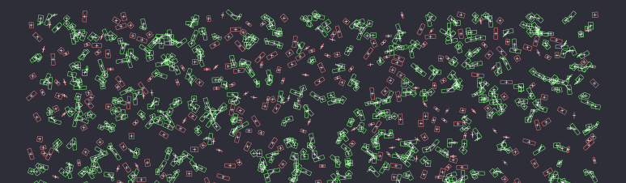

# isect2d



Collision detection algorithms, using basic tile grid for broad-phase and separating axes theorem
(SAT) for narrow-phase.

Example
=======

```cpp
// Provide your own vector 2d implementation
#ifdef USE_GLM
using Vec2 = glm::vec2;
#else
using Vec2 = isect2d::Vec2;
#endif

std::vector<isect2d::OBB> obbs;
std::vector<isect2d::AABB> aabbs;

// Init the set of OBBs from the AABBs set
for (auto& obb : obbs) {
    auto aabb = obb.getExtent();
    aabbs.push_back(aabb);
}
```

Using the Isect2D context
-------------------------

```cpp
isect2d::ISect2D<Vec2> context({16, 16}, {800, 600});

context.clear();

// Broadphase
context.intersect(aabbs);

// Narrow-phase
for (auto& pair : context.pairs) {
    if (intersect(obbs[pair.first], obbs[pair.second])) {
        // Both oriented bounding boxes collide
    }
}
```

Using the naive grid based implementation
-----------------------------------------

```cpp
// Broadphase
auto pairs = intersect(
    aabbs, 
    {4, 4},     // split resolution  
    {800, 600}, // screen resolution
);

// Narrow-phase
for (auto& pair : pairs) {
    if (intersect(obbs[pair.first], obbs[pair.second])) {
        // Both oriented bounding boxes collide
    }
}
```
